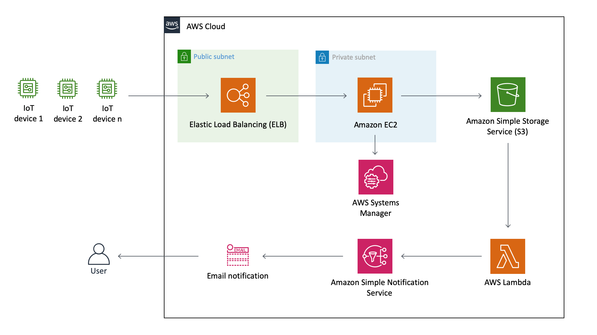
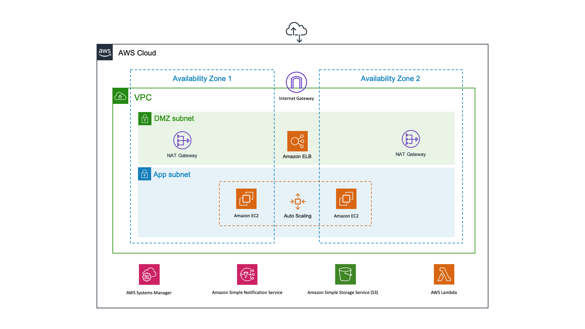

## AWS APIs & Infrastructure as Code - IoT App
This workshop aims to show how AWS API's can be manipulated using AWS-CLI and AWSK-SDK, and how to manage resources with AWS CloudFormation through IaC (Infrastructure as Code) approach.

For this, we'll use a dummy IoT solution composed of two Node.JS applications, one simulating a thing like networking equipment generating random requests to inform its bandwidth consumption, and the other is a gateway application that will receive and store each of these requests on Amazon S3. Further, they will be analyzed by an AWS Lambda function to check if its bandwidth is beyond a pre-defined threshold to send an e-mail notification by Amazon SNS (Simple Notification Service).

### Architecture Blueprint

### Infrastructure Deployment


To get started you will need an IAM user with the following access:
- Amazon EC2
- Amazon S3
- AWS Lambda
- AWS Systems Manager
- Amazon Simple Notification Service
- AWS CloudFormation

_Note: Tested in the N. Virginia region (us-east-1)._


## CloudFormation
1. Open the CloudFormation console at https://console.aws.amazon.com/cloudformation
2. On the Welcome page, click on **Create stack** button
3. On Step 1 - Specify template: Choose Upload a template file, click on **Choose file** button and select the **template.yaml** located inside **cloudformation** directory
4. On Step 2 - Specify stack details: Enter the Stack name as **'iot-stack'**
5. On Step 3 - Configure stack options: Just click on **Next** button
6. On Step 4 - Review: Enable the checkbox **I acknowledge that AWS CloudFormation might create IAM resources with custom names.**, and click on **Create Stack** button
7. Wait for the stack get into status **CREATE_COMPLETE**
8. Under the Outputs tab, take note of **LoadBalancerDNS** value
  
  
## Create a S3 bucket and SSM Parameter
1. Open the Cloud9 console at https://console.aws.amazon.com/cloud9
2. Click on **Open IDE** button of 'iot-environment' which was created by CloudFormation
3. Select the **bash** tab and enter the following commands:

```
bucket=<YOUR_PREFIX>-network-iot
aws s3 mb s3://$bucket
aws ssm put-parameter --name "/iot/bucket" --value "$bucket" --type String
git clone https://github.com/aws-samples/aws-api-manipulation-workshop.git
cd aws-api-manipulation-workshop
aws s3 cp gateway s3://$bucket/gateway --recursive
```

_Note: **<YOUR_PREFIX>** must be replaced with your nickname to avoid conflicts due S3 global namespace_


## Create a SNS Topic & Subscription ##
1. Open the SNS (Simple Notification Service) console at https://console.aws.amazon.com/sns
2. In the navigation pane select Topics, and then click on **Create topic** button
3. Enter the topic name as **'IoT-HighBandwidthUsage'** and then click on **Create topic** button
4. Under the Details panel, take note of topic **ARN** which should look like _arn:aws:sns:us-east-1:123456789012:IoT-HighBandwidthUsage_
5. In the navigation pane select Subscriptions, and then click on **Create subscription** button
6. In Topic ARN select the value from step 4
7. In Protocol select **'Email'**
8. Enter your e-mail on **'Endpoint'** 


## Create a Lambda Function ##
1. Open the Lambda console at https://console.aws.amazon.com/lambda
2. In the navigation pane select Functions, and then click on **Create function** button
3. Enter the Function name as **'IoT-HighBandwidthUsage'**
4. Expand the Permissions section, on Execution role choose to **Use an existing role**, select Existing role as **iot-event-notification-lambda-role** and then click on **Create function** button
5. Replace the sample source code by the content located in the **index.js** located inside lambda directory, and observe how AWS-SDK is used to manipulate files on S3 and to send notifications using SNS
6. On Environment variables add two variables:
   - **'THRESHOLD'** with value **'95'**
   - **'TOPIC_ARN'** with a value containing the SNS Topic ARN annotated previously


## Configure an S3 Event ##
1. Open the S3 console at https://console.aws.amazon.com/s3
2. Click on the name of the bucket previously created
3. Under Properties tab, click on Events and then **Add notification button**
4. Enter the Name as 'PutObjectEvent'
5. Just select PUT checkbox
6. On Send to select **Lambda Function**
7. On Lambda select **IoT-HighBandwidthUsage**
8. Click on **Save** button


## Update EC2 AutoScalingGroup ##
1. Open the Cloud9 console at https://console.aws.amazon.com/cloud9
2. Click on **Open IDE** button of 'iot-environment' which was created by CloudFormation
3. Open the **template.yaml** file located inside **cloudformation** directory
4. Search for the element **'AppASG'**, update its parameters as follow
```
MinSize: 2
MaxSize: 2
DesiredCapacity: 2
```
5. Save and close the file
6. Select the **bash** tab and enter the following command to update the CloudFormation:
```
aws --region us-east-1 cloudformation update-stack --stack-name iot-stack --template-body file://cloudformation/template.yaml --capabilities CAPABILITY_NAMED_IAM 
```


## Run IoT client ##
1. Still on the **bash** tab lets run the IoT client to test the solution, running the following commands
```
cd thing
./generateRequest.sh 5
```
_NOTE: This will generate 5x random requests, for each of them with **bandwidth** greater than 95 you will receive a notification e-mail. If none of them has this value, please keep repeating the last command._


## Clean up
1. Open the CloudFormation console at https://console.aws.amazon.com/cloudformation
2. Select **iot-stack** Stack and click on **Delete** button
3. Delete the remaining objects in the following order: 
  - Lambda Function
  - SNS Subscriber
  - SNS Topic
  - S3 Bucket
  - SSM Parameter


## Reference links
https://aws.amazon.com/cli/

https://aws.amazon.com/tools/

https://aws.amazon.com/sdk-for-node-js/


## License summary
This sample code is made available under the MIT-0 license. See the LICENSE file.
